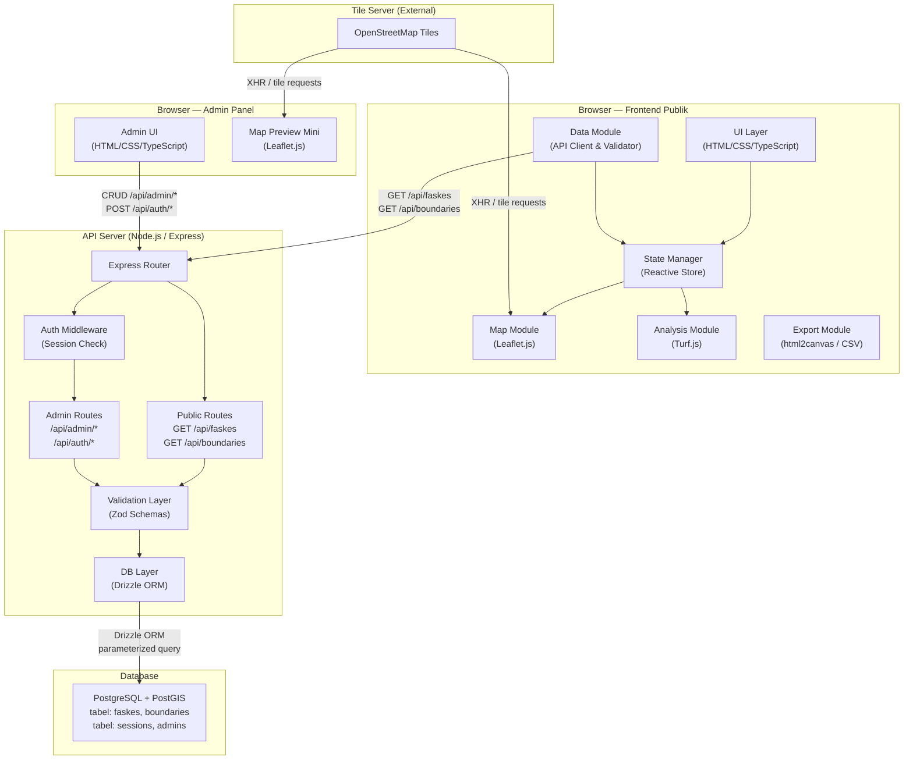
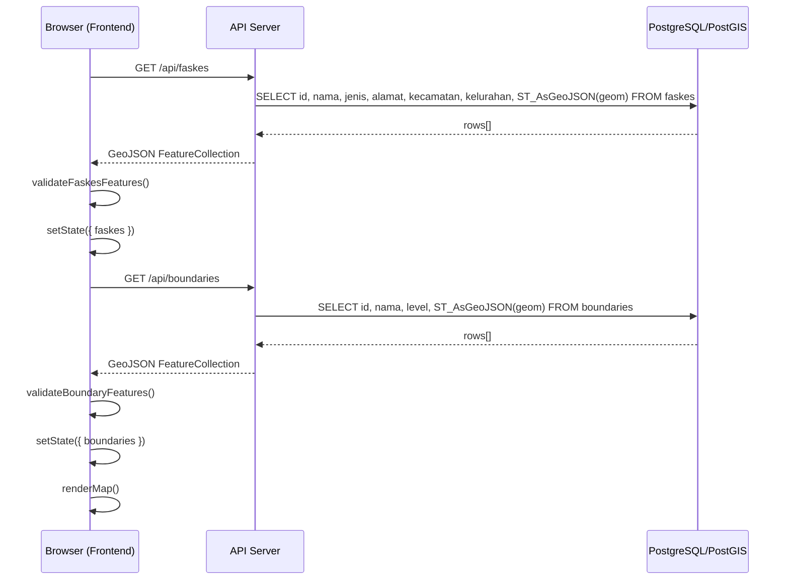
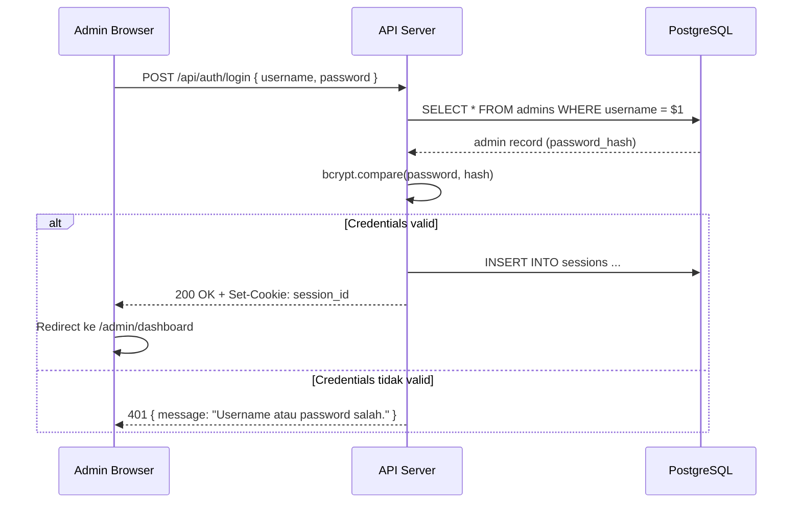

# Design Document

## GIS Analisis Jangkauan Fasilitas Kesehatan Bandar Lampung

---

## Overview

Sistem GIS Analisis Jangkauan Faskes Bandar Lampung adalah aplikasi web **full-stack** yang memungkinkan pengguna memvisualisasikan dan menganalisis aksesibilitas fasilitas kesehatan di wilayah Bandar Lampung. Sistem terdiri dari tiga bagian utama:

1. **Frontend publik** — antarmuka peta interaktif berbasis Leaflet.js + Turf.js untuk visualisasi dan analisis spasial
2. **Backend API server** — Node.js/Express yang melayani data dari PostgreSQL/PostGIS ke frontend dan menerima operasi CRUD dari admin
3. **Admin panel** — antarmuka web terproteksi untuk manajemen data faskes dan batas wilayah

Seluruh analisis spasial (buffer, gap area, nearest facility, filter, search) tetap dijalankan di sisi klien menggunakan Turf.js. Data spasial diambil dari API server saat inisialisasi dan tidak lagi dimuat dari file statis.

### Keputusan Desain Utama

| Keputusan | Pilihan | Alasan |
|---|---|---|
| Map library | **Leaflet.js 1.9.x** | Ringan (~42 KB gzip), fully open source, ekosistem plugin besar |
| Spatial analysis (client) | **Turf.js 6.5.x** | Modular, berjalan sepenuhnya di browser, menyediakan semua operasi yang dibutuhkan |
| Backend runtime | **Node.js** | Ekosistem npm yang luas, cocok untuk REST API |
| Backend framework | **Express.js** | Mature, middleware ecosystem luas, familiar |
| ORM / Query builder | **Drizzle ORM** | Type-safe, mendukung parameterized query, mendukung PostGIS via sql template tag |
| Database | **PostgreSQL + PostGIS** | Dukungan spatial query native (ST_AsGeoJSON, GIST index) |
| Auth | **express-session + connect-pg-simple** | Session tersimpan di DB (persistent antar restart), tidak perlu manage JWT refresh |
| Password hashing | **bcryptjs** | Pure JS, tidak perlu native bindings, mendukung cost factor konfigurasi |
| DB migration | **Drizzle Kit** | Konsisten dengan Drizzle ORM, menghasilkan SQL migration yang idempoten |
| Input validation | **Zod** | Type-safe schema validation, terintegrasi dengan TypeScript |
| Rate limiting | **express-rate-limit** | Middleware sederhana, tidak perlu Redis untuk use case ini |
| Rendering strategy | **Canvas renderer** (L.Canvas) | Performa lebih baik untuk layer dengan banyak feature |
| Map tiles | **OpenStreetMap** | Gratis, tanpa API key |
| Export PNG | **html2canvas** | Dapat mengekspor peta beserta semua overlay GeoJSON |
| Build tool | **Vite** | Fast cold start, native ESM support |
| Language | **TypeScript** (seluruh stack) | Type safety end-to-end untuk data GeoJSON dan domain model |

---

## Architecture

Aplikasi mengikuti arsitektur **full-stack** dengan pemisahan yang jelas antara frontend publik, API server, admin panel, dan database.



### Alur Data — Inisialisasi Frontend



### Alur Data — Login Admin



---

## Components and Interfaces

### Struktur Direktori Proyek

```
project-root/
├── packages/
│   ├── frontend/          # SPA publik (Vite + TypeScript)
│   │   ├── src/
│   │   │   ├── data/      # Data Module (API client, validator)
│   │   │   ├── analysis/  # Analysis Module (Turf.js wrappers)
│   │   │   ├── map/       # Map Module (Leaflet.js)
│   │   │   ├── export/    # Export Module
│   │   │   ├── state/     # State Manager
│   │   │   └── main.ts
│   │   └── index.html
│   ├── admin/             # Admin Panel (Vite + TypeScript)
│   │   ├── src/
│   │   │   ├── pages/     # Login, Dashboard, Faskes, Boundaries
│   │   │   ├── components/
│   │   │   └── main.ts
│   │   └── index.html
│   └── server/            # API Server (Node.js + Express)
│       ├── src/
│       │   ├── routes/    # Express routers
│       │   ├── middleware/ # auth, rateLimit, errorHandler
│       │   ├── db/        # Drizzle schema + migrations
│       │   ├── schemas/   # Zod validation schemas
│       │   └── app.ts
│       └── drizzle.config.ts
└── package.json           # Workspace root
```

---

### 1. Backend — Database Schema (Drizzle ORM)

```typescript
// packages/server/src/db/schema.ts
import { pgTable, uuid, text, check } from 'drizzle-orm/pg-core';
import { sql } from 'drizzle-orm';

export const faskes = pgTable('faskes', {
  id: uuid('id').defaultRandom().primaryKey(),
  nama: text('nama').notNull(),
  jenis: text('jenis').notNull(),
  alamat: text('alamat').notNull().default(''),
  kecamatan: text('kecamatan').notNull().default(''),
  kelurahan: text('kelurahan').notNull().default(''),
  // Kolom geom dikelola via sql raw (PostGIS tidak didukung native di Drizzle)
  // Tipe: geometry(Point, 4326)
}, (table) => ({
  geomNotNull: check('geom_not_null', sql`geom IS NOT NULL`),
}));

export const boundaries = pgTable('boundaries', {
  id: uuid('id').defaultRandom().primaryKey(),
  nama: text('nama').notNull(),
  level: text('level').notNull(), // 'kecamatan' | 'kelurahan'
}, (table) => ({
  levelCheck: check('level_check', sql`level IN ('kecamatan', 'kelurahan')`),
  geomNotNull: check('geom_not_null', sql`geom IS NOT NULL`),
}));

export const admins = pgTable('admins', {
  id: uuid('id').defaultRandom().primaryKey(),
  username: text('username').notNull().unique(),
  passwordHash: text('password_hash').notNull(),
  createdAt: text('created_at').notNull().default(sql`NOW()`),
});
```

**Migration SQL (Drizzle Kit akan menghasilkan):**

```sql
-- 0001_initial.sql (idempoten — menggunakan IF NOT EXISTS)
CREATE EXTENSION IF NOT EXISTS postgis;

CREATE TABLE IF NOT EXISTS faskes (
  id UUID PRIMARY KEY DEFAULT gen_random_uuid(),
  nama TEXT NOT NULL,
  jenis TEXT NOT NULL,
  alamat TEXT NOT NULL DEFAULT '',
  kecamatan TEXT NOT NULL DEFAULT '',
  kelurahan TEXT NOT NULL DEFAULT '',
  geom geometry(Point, 4326) NOT NULL,
  CONSTRAINT geom_not_null CHECK (geom IS NOT NULL)
);

CREATE INDEX IF NOT EXISTS faskes_geom_gist ON faskes USING GIST (geom);

CREATE TABLE IF NOT EXISTS boundaries (
  id UUID PRIMARY KEY DEFAULT gen_random_uuid(),
  nama TEXT NOT NULL,
  level TEXT NOT NULL CHECK (level IN ('kecamatan', 'kelurahan')),
  geom geometry(MultiPolygon, 4326) NOT NULL,
  CONSTRAINT geom_not_null CHECK (geom IS NOT NULL)
);

CREATE INDEX IF NOT EXISTS boundaries_geom_gist ON boundaries USING GIST (geom);

CREATE TABLE IF NOT EXISTS admins (
  id UUID PRIMARY KEY DEFAULT gen_random_uuid(),
  username TEXT NOT NULL UNIQUE,
  password_hash TEXT NOT NULL,
  created_at TIMESTAMPTZ NOT NULL DEFAULT NOW()
);
```

---

### 2. Backend — Zod Validation Schemas

```typescript
// packages/server/src/schemas/faskes.schema.ts
import { z } from 'zod';

const BANDAR_LAMPUNG_BBOX = {
  minLat: -5.52, maxLat: -5.28,
  minLon: 105.18, maxLon: 105.42,
};

export const FaskesCreateSchema = z.object({
  nama: z.string().min(1, 'Nama tidak boleh kosong'),
  jenis: z.string().min(1, 'Jenis tidak boleh kosong'),
  alamat: z.string().default(''),
  kecamatan: z.string().default(''),
  kelurahan: z.string().default(''),
  latitude: z.number()
    .min(BANDAR_LAMPUNG_BBOX.minLat, 'Latitude di luar wilayah Bandar Lampung')
    .max(BANDAR_LAMPUNG_BBOX.maxLat, 'Latitude di luar wilayah Bandar Lampung'),
  longitude: z.number()
    .min(BANDAR_LAMPUNG_BBOX.minLon, 'Longitude di luar wilayah Bandar Lampung')
    .max(BANDAR_LAMPUNG_BBOX.maxLon, 'Longitude di luar wilayah Bandar Lampung'),
});

export const FaskesUpdateSchema = FaskesCreateSchema.partial();

export const BoundaryUpdateSchema = z.object({
  nama: z.string().min(1, 'Nama tidak boleh kosong').optional(),
  level: z.enum(['kecamatan', 'kelurahan']).optional(),
});

export const BoundaryGeometrySchema = z.object({
  type: z.literal('Feature').or(z.literal('Polygon')).or(z.literal('MultiPolygon')),
  // Parsing geometry; validasi ring dilakukan di server logic layer
});

export type FaskesCreate = z.infer<typeof FaskesCreateSchema>;
export type FaskesUpdate = z.infer<typeof FaskesUpdateSchema>;
export type BoundaryUpdate = z.infer<typeof BoundaryUpdateSchema>;
```

---

### 3. Backend — API Routes

```typescript
// packages/server/src/routes/public.ts
import { Router } from 'express';
import { db } from '../db';
import { sql } from 'drizzle-orm';

const router = Router();

// GET /api/faskes — GeoJSON FeatureCollection semua faskes
router.get('/faskes', async (req, res) => {
  const rows = await db.execute(sql`
    SELECT id, nama, jenis, alamat, kecamatan, kelurahan,
           ST_AsGeoJSON(geom)::json AS geometry
    FROM faskes
  `);
  const features = rows.rows.map(rowToFaskesFeature);
  res.json({ type: 'FeatureCollection', features });
});

// GET /api/faskes/:id — GeoJSON Feature satu faskes
router.get('/faskes/:id', async (req, res) => {
  const rows = await db.execute(sql`
    SELECT id, nama, jenis, alamat, kecamatan, kelurahan,
           ST_AsGeoJSON(geom)::json AS geometry
    FROM faskes WHERE id = ${req.params.id}
  `);
  if (rows.rows.length === 0) {
    return res.status(404).json({ error: 'Faskes tidak ditemukan.' });
  }
  res.json(rowToFaskesFeature(rows.rows[0]));
});

// GET /api/boundaries — GeoJSON FeatureCollection semua boundaries
router.get('/boundaries', async (req, res) => {
  const rows = await db.execute(sql`
    SELECT id, nama, level,
           ST_AsGeoJSON(geom)::json AS geometry
    FROM boundaries
  `);
  const features = rows.rows.map(rowToBoundaryFeature);
  res.json({ type: 'FeatureCollection', features });
});

// GET /api/boundaries/:id — GeoJSON Feature satu boundary
router.get('/boundaries/:id', async (req, res) => {
  const rows = await db.execute(sql`
    SELECT id, nama, level,
           ST_AsGeoJSON(geom)::json AS geometry
    FROM boundaries WHERE id = ${req.params.id}
  `);
  if (rows.rows.length === 0) {
    return res.status(404).json({ error: 'Boundary tidak ditemukan.' });
  }
  res.json(rowToBoundaryFeature(rows.rows[0]));
});

export default router;
```

```typescript
// packages/server/src/routes/admin.ts (ringkasan endpoint)

// POST  /api/admin/faskes          — Tambah faskes baru (protected)
// PUT   /api/admin/faskes/:id      — Update faskes (protected)
// DELETE /api/admin/faskes/:id     — Hapus faskes (protected)
// PUT   /api/admin/boundaries/:id  — Update metadata boundary (protected)
// PUT   /api/admin/boundaries/:id/geometry — Upload GeoJSON geometry (protected)

// POST  /api/auth/login            — Login admin
// POST  /api/auth/logout           — Logout admin (protected)
```

---

### 4. Backend — Auth Middleware

```typescript
// packages/server/src/middleware/auth.ts
import { Request, Response, NextFunction } from 'express';

export function requireAuth(req: Request, res: Response, next: NextFunction) {
  if (!req.session?.adminId) {
    return res.status(401).json({ error: 'Tidak terautentikasi. Silakan login.' });
  }
  next();
}

// packages/server/src/middleware/rateLimit.ts
import rateLimit from 'express-rate-limit';

export const loginRateLimiter = rateLimit({
  windowMs: 15 * 60 * 1000, // 15 menit
  max: 5,
  message: { error: 'Terlalu banyak percobaan login. Coba lagi dalam 15 menit.' },
  standardHeaders: true,
  legacyHeaders: false,
});
```

---

### 5. Backend — GeoJSON Geometry Validator

```typescript
// packages/server/src/utils/geometryValidator.ts

interface Ring {
  coordinates: [number, number][];
}

/**
 * Memvalidasi bahwa sebuah ring GeoJSON adalah valid:
 * - Memiliki minimal 4 titik
 * - Titik pertama sama dengan titik terakhir (closed ring)
 */
export function isValidRing(ring: [number, number][]): boolean {
  if (ring.length < 4) return false;
  const first = ring[0];
  const last = ring[ring.length - 1];
  return first[0] === last[0] && first[1] === last[1];
}

/**
 * Memvalidasi GeoJSON geometry untuk boundary upload.
 * Menerima tipe Polygon atau MultiPolygon dengan semua ring valid.
 */
export function validateBoundaryGeometry(geometry: unknown): {
  valid: boolean;
  error?: string;
} {
  if (!geometry || typeof geometry !== 'object') {
    return { valid: false, error: 'Geometry tidak valid.' };
  }
  const geom = geometry as { type: string; coordinates: unknown };
  if (geom.type === 'Polygon') {
    const rings = geom.coordinates as [number, number][][];
    if (!rings.every(isValidRing)) {
      return { valid: false, error: 'Polygon memiliki ring yang tidak valid.' };
    }
    return { valid: true };
  }
  if (geom.type === 'MultiPolygon') {
    const polygons = geom.coordinates as [number, number][][][];
    for (const rings of polygons) {
      if (!rings.every(isValidRing)) {
        return { valid: false, error: 'MultiPolygon memiliki ring yang tidak valid.' };
      }
    }
    return { valid: true };
  }
  return { valid: false, error: `Tipe geometry tidak didukung: ${geom.type}. Harus Polygon atau MultiPolygon.` };
}
```

---

### 6. Frontend — Data Module (API Client)

Data Module diperbarui untuk mengambil data dari API server alih-alih file statis.

```typescript
// packages/frontend/src/data/apiClient.ts
const API_BASE = import.meta.env.VITE_API_BASE_URL ?? '/api';

export async function fetchFaskes(): Promise<ValidationResult> {
  const res = await fetch(`${API_BASE}/faskes`);
  if (!res.ok) {
    if (res.status === 503) {
      throw new Error('Data tidak dapat dimuat. Periksa koneksi atau coba lagi nanti.');
    }
    throw new Error(`Gagal memuat data faskes: HTTP ${res.status}`);
  }
  const geojson = await res.json() as GeoJSON.FeatureCollection;
  return validateFaskesCollection(geojson);
}

export async function fetchBoundaries(): Promise<ValidationResult> {
  const res = await fetch(`${API_BASE}/boundaries`);
  if (!res.ok) {
    if (res.status === 503) {
      throw new Error('Data tidak dapat dimuat. Periksa koneksi atau coba lagi nanti.');
    }
    throw new Error(`Gagal memuat data boundaries: HTTP ${res.status}`);
  }
  const geojson = await res.json() as GeoJSON.FeatureCollection;
  return validateBoundaryCollection(geojson);
}
```

Tipe domain dan interface `ValidationResult`, `FaskesFeature`, `BoundaryFeature`, `DataModule` tetap sama seperti desain sebelumnya; hanya sumber data yang berubah dari `fetch('/data/faskes.geojson')` menjadi `fetch('/api/faskes')`.

---

### 7. Frontend — Analysis Module, Map Module, Export Module, State Manager

Komponen-komponen ini **tidak mengalami perubahan** dari desain sebelumnya. Seluruh logika analisis spasial (buffer, gap area, nearest facility, filter, search) tetap berjalan di sisi klien menggunakan Turf.js.

Lihat bagian Components and Interfaces versi sebelumnya untuk interface lengkap `AnalysisModule`, `MapModule`, `ExportModule`, dan `StateManager`.

---

### 8. Admin Panel — Komponen Halaman

```typescript
// Daftar halaman Admin Panel
// /admin/login        — LoginPage
// /admin/dashboard    — DashboardPage (ringkasan statistik)
// /admin/faskes       — FaskesListPage (tabel + search + sort)
// /admin/faskes/new   — FaskesFormPage (form tambah)
// /admin/faskes/:id   — FaskesFormPage (form edit)
// /admin/boundaries   — BoundaryListPage (tabel)
// /admin/boundaries/:id/edit — BoundaryEditPage (form metadata + upload GeoJSON + preview peta)
```

**FaskesListPage** — tabel dengan kolom: nama, jenis, kecamatan, kelurahan, aksi (edit, hapus). Mendukung search by nama dan sort per kolom. Tombol "Tambah Faskes" di header.

**FaskesFormPage** — form dengan field: nama\*, jenis\*, alamat, kecamatan, kelurahan, latitude\*, longitude\*. Validasi client-side sebelum submit. Menampilkan error per-field tanpa menutup form jika validasi server gagal.

**BoundaryEditPage** — dua bagian:
1. Form metadata: nama\*, level\* (dropdown: kecamatan/kelurahan)
2. Upload GeoJSON: file input + preview peta mini (Leaflet) + tombol konfirmasi

**Admin Router (Express):**

```
POST   /api/auth/login
POST   /api/auth/logout     [requireAuth]

GET    /api/admin/faskes     [requireAuth]   — untuk tabel admin (sama seperti public)
POST   /api/admin/faskes     [requireAuth]   — create
PUT    /api/admin/faskes/:id [requireAuth]   — update
DELETE /api/admin/faskes/:id [requireAuth]   — delete

GET    /api/admin/boundaries            [requireAuth]
PUT    /api/admin/boundaries/:id        [requireAuth]   — update metadata
PUT    /api/admin/boundaries/:id/geometry [requireAuth] — update geometry
```

---

## Data Models

### Skema Tabel Database

**Tabel `faskes`:**

| Kolom | Tipe | Constraint |
|---|---|---|
| `id` | UUID | PRIMARY KEY, DEFAULT gen_random_uuid() |
| `nama` | TEXT | NOT NULL |
| `jenis` | TEXT | NOT NULL |
| `alamat` | TEXT | NOT NULL DEFAULT '' |
| `kecamatan` | TEXT | NOT NULL DEFAULT '' |
| `kelurahan` | TEXT | NOT NULL DEFAULT '' |
| `geom` | geometry(Point, 4326) | NOT NULL |

Indeks: `faskes_geom_gist` GIST pada kolom `geom`.

**Tabel `boundaries`:**

| Kolom | Tipe | Constraint |
|---|---|---|
| `id` | UUID | PRIMARY KEY, DEFAULT gen_random_uuid() |
| `nama` | TEXT | NOT NULL |
| `level` | TEXT | NOT NULL CHECK (level IN ('kecamatan', 'kelurahan')) |
| `geom` | geometry(MultiPolygon, 4326) | NOT NULL |

Indeks: `boundaries_geom_gist` GIST pada kolom `geom`.

**Tabel `admins`:**

| Kolom | Tipe | Constraint |
|---|---|---|
| `id` | UUID | PRIMARY KEY |
| `username` | TEXT | NOT NULL UNIQUE |
| `password_hash` | TEXT | NOT NULL (bcrypt, cost ≥ 10) |
| `created_at` | TIMESTAMPTZ | NOT NULL DEFAULT NOW() |

**Tabel `sessions`** (dikelola oleh `connect-pg-simple`): berisi `sid`, `sess`, `expire`.

---

### Format GeoJSON API Response

**GET /api/faskes — GeoJSON FeatureCollection:**

```json
{
  "type": "FeatureCollection",
  "features": [
    {
      "type": "Feature",
      "geometry": {
        "type": "Point",
        "coordinates": [105.2610, -5.3971]
      },
      "properties": {
        "id": "550e8400-e29b-41d4-a716-446655440000",
        "nama": "RSUD Abdul Moeloek",
        "jenis": "rumah_sakit",
        "alamat": "Jl. Dr. Rivai No.6, Bandar Lampung",
        "kecamatan": "Enggal",
        "kelurahan": "Pelita"
      }
    }
  ]
}
```

**GET /api/boundaries — GeoJSON FeatureCollection:**

```json
{
  "type": "FeatureCollection",
  "features": [
    {
      "type": "Feature",
      "geometry": {
        "type": "MultiPolygon",
        "coordinates": [[[[105.2, -5.3], [105.3, -5.3], [105.3, -5.4], [105.2, -5.4], [105.2, -5.3]]]]
      },
      "properties": {
        "id": "660e8400-e29b-41d4-a716-446655440001",
        "nama": "Kecamatan Enggal",
        "level": "kecamatan"
      }
    }
  ]
}
```

---

### Aturan Validasi

**Faskes (frontend & backend):**

| Field | Aturan Validasi |
|---|---|
| `geometry.type` | Harus `"Point"` |
| `coordinates[0]` (longitude) | `105.18 ≤ lon ≤ 105.42` |
| `coordinates[1]` (latitude) | `-5.52 ≤ lat ≤ -5.28` |
| `properties.nama` | String tidak kosong |
| `properties.jenis` | String tidak kosong |

**Boundary (frontend & backend):**

| Field | Aturan Validasi |
|---|---|
| `geometry.type` | Harus `"Polygon"` atau `"MultiPolygon"` |
| Setiap ring | Minimal 4 titik; titik pertama = titik terakhir (closed ring) |
| `properties.nama` | String tidak kosong |
| `properties.level` | Nilai harus `"kecamatan"` atau `"kelurahan"` |

---

### Format HTTP Error Response

Semua error response menggunakan format JSON yang konsisten:

```json
{
  "error": "Pesan error utama.",
  "details": {
    "field_name": "Pesan error spesifik untuk field ini."
  }
}
```

Field `details` hanya ada untuk validasi multi-field (misalnya pada POST/PUT faskes).

---

### Struktur CSV Ekspor (tidak berubah dari versi sebelumnya)

**Buffer Analysis:**
```csv
id,nama,jenis,alamat,kecamatan,lat,lon,buffer_radius_m,tanggal_ekspor
```

**Faskes Terdekat:**
```csv
rank,nama,jenis,alamat,kecamatan,lat,lon,jarak_km,titik_analisis_lat,titik_analisis_lon,tanggal_ekspor
```

**Statistik Cakupan Wilayah:**
```csv
nama_wilayah,total_area_km2,area_terlayani_km2,area_tidak_terlayani_km2,persentase_cakupan,buffer_radius_m,tanggal_ekspor
```

---

## Correctness Properties

*A property is a characteristic or behavior that should hold true across all valid executions of a system — essentially, a formal statement about what the system should do. Properties serve as the bridge between human-readable specifications and machine-verifiable correctness guarantees.*

### Analisis Redundansi Properties (Reflection)

Dari prework analysis, dilakukan refleksi untuk menghilangkan redundansi sebelum penulisan:

**Properties Frontend (Req. 1–10) — tidak berubah, tetap 10 properties:**
- Property 1–10 dari desain sebelumnya tetap valid dan non-redundan.

**Properties Backend Baru (Req. 11–15) — kandidat setelah refleksi:**
- 11.1 dan 11.3 digabung: keduanya menguji "collection endpoint mengembalikan FeatureCollection dengan jumlah features yang sama" → **B1: Collection Endpoint Serialization**
- 11.2 dan 11.4 digabung: keduanya menguji "GET by ID mengembalikan Feature yang matching" → **B2: Lookup by ID Round-Trip**
- 11.5 → **B3: Not-Found Returns 404** (unik, tidak redundan)
- 12.4 → **B4: Unauthenticated Requests Rejected** (unik)
- 12.5 → **B5: Rate Limiting After 5 Failed Attempts** (unik)
- 12.7 → **B6: Password Stored as bcrypt Hash** (unik)
- 13.3 + 13.8 digabung: keduanya menguji validasi input faskes API → **B7: Invalid Faskes Input Rejected with Field Errors**
- 14.3 → **B8: Invalid Boundary Metadata Input Rejected** (unik)
- 14.5 = validasi geometry boundary di backend. Property 9 di frontend menguji hal serupa tetapi di lapisan validasi frontend. Keduanya menguji logika `validateBoundaryGeometry()` yang sama (atau serupa) — digabung menjadi satu property yang komprehensif yang berlaku untuk kedua konteks → **diperbarui Property 9** untuk mencakup keduanya.
- 15.7 → **B9: Migration Idempotence** (unik)

Total setelah refleksi: 10 properties frontend + 9 properties backend = **19 properties** yang unik dan non-redundan.

---

### Properties Frontend (Req. 1–10)

### Property 1: Marker Count Invariant

*For any* array of valid faskes features, the number of markers rendered on the map SHALL equal the number of faskes features in the array.

**Validates: Requirements 2.2, 4.3, 4.4**

---

### Property 2: Popup Contains Required Fields

*For any* faskes feature with valid properties, when the popup for that marker is opened, the popup content SHALL contain the nama, jenis, and alamat values from the feature's properties.

**Validates: Requirements 2.4**

---

### Property 3: Distinct Visual Encoding by Type

*For any* two faskes features with different `jenis` values, the marker icon or color used to render them SHALL be visually distinct (different icon class or different color code).

**Validates: Requirements 2.5**

---

### Property 4: Buffer Radius Validation

*For any* numeric input value `r`, the validation function SHALL accept `r` if and only if `100 ≤ r ≤ 5000`. For all `r < 100` or `r > 5000` (including NaN, negative, and zero), the function SHALL return an error.

**Validates: Requirements 4.2**

---

### Property 5: Coverage Calculation Accuracy

*For any* boundary polygon and union buffer polygon with known areas, the coverage percentage SHALL equal `(intersection_area / boundary_area) × 100`, and the gap area SHALL equal `boundary_area - intersection_area`. The sum of covered area and uncovered area SHALL equal the total boundary area (within floating-point tolerance of 0.001 km²).

**Validates: Requirements 5.1, 5.3, 5.4, 5.5**

---

### Property 6: Filter Completeness and Exclusiveness

*For any* dataset of faskes features and any selected filter type `T`, the filter function SHALL return all features where `jenis === T` and SHALL exclude all features where `jenis !== T`. When filter is 'all', all features SHALL be returned.

**Validates: Requirements 6.2**

---

### Property 7: Search Substring Matching

*For any* dataset of faskes features and any non-empty search keyword `k`, the search function SHALL return all features where `nama.toLowerCase().includes(k.toLowerCase())` is true, and SHALL exclude all features where it is false.

**Validates: Requirements 6.4**

---

### Property 8: Nearest Facility Distance Ordering

*For any* analysis point and any array of faskes features with at least 1 element, the result of findNearestFacilities SHALL be sorted in ascending order by distanceKm, and the distanceKm for each item SHALL equal the Haversine distance between the analysis point and that faskes's coordinates.

**Validates: Requirements 7.2, 7.3, 7.4**

---

### Property 9: Coordinate and GeoJSON Validation (Frontend & API)

*For any* faskes record, the validation function SHALL accept it if and only if: (1) latitude and longitude are finite numbers, (2) `105.18 ≤ lon ≤ 105.42` and `-5.52 ≤ lat ≤ -5.28`. For any boundary geometry (baik dari API response maupun file upload), the validation function SHALL accept it if and only if: geometry type is Polygon or MultiPolygon, all rings are closed (first point equals last point), and each ring has at least 4 points.

**Validates: Requirements 9.2, 9.3, 9.4, 9.5, 14.5**

---

### Property 10: CSV Serialization Round-Trip

*For any* array of export rows with known values, the CSV serialization function SHALL produce a string where: (1) the first row contains all expected column headers, (2) each subsequent row represents one data row with all values present, (3) values containing commas or newlines are properly quoted, and (4) parsing the resulting CSV string SHALL recover the original values.

**Validates: Requirements 8.4, 8.5**

---

### Properties Backend (Req. 11–15)

### Property 11: Collection Endpoint Returns Valid GeoJSON FeatureCollection

*For any* array of faskes records (atau boundary records) di database (mock), pemanggilan endpoint `GET /api/faskes` (atau `GET /api/boundaries`) SHALL mengembalikan JSON dengan `type: "FeatureCollection"` dan array `features` dengan panjang yang sama dengan jumlah record di database, dan setiap feature SHALL memiliki `type: "Feature"`, geometry yang valid, dan properties dengan nilai yang sesuai dengan record asli.

**Validates: Requirements 11.1, 11.3**

---

### Property 12: Lookup by ID Returns Matching GeoJSON Feature

*For any* faskes atau boundary record yang ada di database (mock), pemanggilan `GET /api/faskes/:id` (atau `GET /api/boundaries/:id`) dengan ID record tersebut SHALL mengembalikan status 200 dan JSON dengan `type: "Feature"`, geometry yang valid, dan properties yang identik dengan record yang di-lookup.

**Validates: Requirements 11.2, 11.4**

---

### Property 13: Not-Found ID Returns 404

*For any* ID string yang tidak ada dalam dataset faskes atau boundary (mock), pemanggilan `GET /api/faskes/:id` atau `GET /api/boundaries/:id` dengan ID tersebut SHALL mengembalikan HTTP status 404 dan response body JSON yang mengandung field `error`.

**Validates: Requirements 11.5**

---

### Property 14: Unauthenticated Requests Rejected on All Protected Routes

*For any* HTTP request ke protected route (`/api/admin/*` atau `POST /api/auth/logout`) tanpa session cookie yang valid, server SHALL mengembalikan HTTP status 401 dan menolak memproses permintaan tersebut.

**Validates: Requirements 12.4**

---

### Property 15: Rate Limiting Enforced After 5 Failed Login Attempts

*For any* IP address, setelah 5 percobaan login yang gagal dalam jendela waktu 15 menit, percobaan login ke-6 dan seterusnya dari IP yang sama SHALL ditolak dengan HTTP status 429, tanpa melakukan pengecekan kredensial.

**Validates: Requirements 12.5**

---

### Property 16: Password Stored as bcrypt Hash with Sufficient Cost Factor

*For any* password string (sembarang panjang dan karakter), fungsi penyimpanan password SHALL menghasilkan hash yang: (1) dapat diverifikasi menggunakan `bcrypt.compare(password, hash)` mengembalikan `true`, (2) hash yang disimpan berbeda dari password asli, dan (3) cost factor yang digunakan adalah ≥ 10 (dapat diverifikasi dari prefix hash `$2b$10$` atau lebih tinggi).

**Validates: Requirements 12.7**

---

### Property 17: Invalid Faskes Input Rejected with Field-Specific Errors

*For any* faskes creation atau update payload yang mengandung setidaknya satu field tidak valid (nama kosong, jenis kosong, atau koordinat di luar bounding box Bandar Lampung), endpoint `POST /api/admin/faskes` atau `PUT /api/admin/faskes/:id` SHALL mengembalikan HTTP status 400 dan response body yang mengandung field `details` dengan pesan error yang menyebutkan field mana yang tidak valid, dan record di database SHALL tidak dimodifikasi.

**Validates: Requirements 13.3, 13.8**

---

### Property 18: Invalid Boundary Metadata Input Rejected

*For any* boundary metadata update payload dengan `nama` yang kosong atau `level` yang bukan `"kecamatan"` atau `"kelurahan"`, endpoint `PUT /api/admin/boundaries/:id` SHALL mengembalikan HTTP status 400 dan response body yang mengandung field `error`, dan record di database SHALL tidak dimodifikasi.

**Validates: Requirements 14.3**

---

### Property 19: Database Migration is Idempotent

*For any* jumlah eksekusi skrip migrasi (1 kali, 2 kali, atau lebih), state database setelah eksekusi ke-N SHALL identik dengan state setelah eksekusi pertama: tabel `faskes`, `boundaries`, `admins` ada dengan kolom dan constraint yang benar, indeks GIST ada, dan data yang sudah ada sebelumnya tidak terhapus atau berubah.

**Validates: Requirements 15.7**

---

## Error Handling

### Strategi Error Handling — Frontend

| Lapisan | Jenis Error | Penanganan |
|---|---|---|
| API client | HTTP 503 dari API server | Tampilkan "Data tidak dapat dimuat. Periksa koneksi atau coba lagi nanti." |
| API client | Network error (fetch gagal) | Tampilkan "Data tidak dapat dimuat. Periksa koneksi atau coba lagi nanti." |
| API client | HTTP error lainnya | Tampilkan "Gagal memuat data: HTTP {status}" |
| Validasi | Record dengan koordinat tidak valid | Log error per-record, skip record tidak valid, lanjutkan dengan data valid |
| Validasi | Dataset kosong setelah validasi | Tampilkan warning "Tidak ada data valid yang dapat ditampilkan." |
| Analisis | Turf.js error (geometri tidak valid) | Tangkap exception, tampilkan notifikasi "Analisis gagal untuk beberapa area." |
| Ekspor | Canvas tainted (CORS) | Tampilkan "Ekspor PNG tidak tersedia karena batasan browser." |
| Network | Tile gagal dimuat | Leaflet menangani secara internal |

### Strategi Error Handling — Backend

| Lapisan | Jenis Error | Penanganan |
|---|---|---|
| Route handler | DB unreachable | Log error, kembalikan HTTP 503 + `{ error: "Layanan tidak tersedia sementara." }` |
| Route handler | Record tidak ditemukan | Kembalikan HTTP 404 + `{ error: "... tidak ditemukan." }` |
| Auth middleware | Session tidak valid / tidak ada | Kembalikan HTTP 401 + `{ error: "Tidak terautentikasi." }` |
| Validation layer | Input tidak valid (Zod) | Kembalikan HTTP 400 + `{ error: "...", details: { field: "pesan" } }` |
| Rate limiter | Batas percobaan login terlampaui | Kembalikan HTTP 429 + `{ error: "Terlalu banyak percobaan login." }` |
| Login | Credentials tidak valid | Kembalikan HTTP 401 + `{ error: "Username atau password salah." }` (pesan generic) |
| File upload | File GeoJSON tidak valid | Kembalikan HTTP 400 + `{ error: "Format GeoJSON tidak valid: ..." }` |
| Global | Error tak terduga | Log error, kembalikan HTTP 500 + `{ error: "Terjadi kesalahan internal." }` |

### Error State UI — Frontend

```typescript
interface ErrorNotification {
  type: 'error' | 'warning' | 'info';
  message: string;
  dismissible: boolean;
  duration?: number; // ms, undefined = persistent
}
```

Notifikasi error ditampilkan di pojok kanan atas layar dengan animasi slide-in. Error kritis (API tidak dapat dijangkau) bersifat persistent dan memblokir interaksi analisis. Error non-kritis (record tidak valid) dapat di-dismiss oleh user.

### Validasi Input Buffer Radius

```typescript
function validateBufferRadius(value: unknown): { valid: boolean; error?: string } {
  if (typeof value !== 'number' || isNaN(value)) {
    return { valid: false, error: 'Radius harus berupa angka.' };
  }
  if (value < 100) {
    return { valid: false, error: 'Radius minimal 100 meter.' };
  }
  if (value > 5000) {
    return { valid: false, error: 'Radius maksimal 5000 meter.' };
  }
  return { valid: true };
}
```

---

## Testing Strategy

### Stack Pengujian

| Jenis | Library | Target |
|---|---|---|
| Unit test (frontend) | **Vitest** | Pure functions: validasi, kalkulasi, serialisasi, API client |
| Unit test (backend) | **Vitest** | Route handlers (mock DB), middleware, validators |
| Property-based test | **fast-check** | Properties 1–19 di atas |
| Integration test | **Vitest + supertest** | API endpoints end-to-end dengan DB test (atau mock DB) |
| E2E / Component test | **Playwright** | Map rendering, UI interaction, admin panel, responsive layout |

### Dual Testing Approach

- **Unit tests**: Memverifikasi contoh spesifik, edge case, dan kondisi error
- **Property tests**: Memverifikasi properti universal yang berlaku untuk semua input valid

Keduanya komplementer: unit test menangkap bug konkret, property test memverifikasi kebenaran umum.

---

### Property-Based Tests

Library yang dipilih: **fast-check** (TypeScript-native, terintegrasi dengan Vitest, arbitrary generators kaya).

Setiap property test dikonfigurasi untuk **minimum 100 iterasi** (default fast-check: 100 runs).

Tag format: `// Feature: gis-faskes-bandar-lampung, Property N: <deskripsi singkat>`

#### Contoh implementasi — Property 11 (Collection Endpoint Serialization):

```typescript
// Feature: gis-faskes-bandar-lampung, Property 11: Collection endpoint returns valid GeoJSON FeatureCollection
import fc from 'fast-check';
import { buildFaskesFeatureCollection } from '../src/routes/public.helpers';

const faskesRowArbitrary = () => fc.record({
  id: fc.uuid(),
  nama: fc.string({ minLength: 1, maxLength: 50 }),
  jenis: fc.constantFrom('rumah_sakit', 'puskesmas', 'klinik', 'apotek'),
  alamat: fc.string(),
  kecamatan: fc.string(),
  kelurahan: fc.string(),
  geometry: fc.record({
    type: fc.constant('Point'),
    coordinates: fc.tuple(
      fc.float({ min: 105.18, max: 105.42 }),
      fc.float({ min: -5.52, max: -5.28 }),
    ),
  }),
});

test('Property 11: buildFaskesFeatureCollection menghasilkan FeatureCollection yang valid', () => {
  fc.assert(
    fc.property(fc.array(faskesRowArbitrary(), { minLength: 0, maxLength: 100 }), (rows) => {
      const result = buildFaskesFeatureCollection(rows);
      return (
        result.type === 'FeatureCollection' &&
        result.features.length === rows.length &&
        result.features.every(f => f.type === 'Feature' && f.geometry !== null)
      );
    })
  );
});
```

#### Contoh implementasi — Property 15 (Rate Limiting):

```typescript
// Feature: gis-faskes-bandar-lampung, Property 15: Rate limiting after 5 failed attempts
import fc from 'fast-check';
import { createRateLimitStore } from '../src/middleware/rateLimit.store';

test('Property 15: Percobaan ke-6 selalu ditolak setelah 5 gagal dalam window', () => {
  fc.assert(
    fc.property(
      fc.ipV4(),
      fc.integer({ min: 0, max: 14 }), // menit dalam window
      (ip, minutesElapsed) => {
        const store = createRateLimitStore({ windowMs: 15 * 60 * 1000, max: 5 });
        // Simulasi 5 percobaan gagal
        for (let i = 0; i < 5; i++) store.recordAttempt(ip, minutesElapsed * 60 * 1000);
        // Percobaan ke-6 harus ditolak
        return store.isBlocked(ip, minutesElapsed * 60 * 1000) === true;
      }
    )
  );
});
```

#### Contoh implementasi — Property 16 (bcrypt hash):

```typescript
// Feature: gis-faskes-bandar-lampung, Property 16: Password stored as bcrypt hash
import fc from 'fast-check';
import bcrypt from 'bcryptjs';
import { hashPassword } from '../src/auth/password';

test('Property 16: hashPassword selalu menghasilkan hash yang valid dan verifiable', async () => {
  await fc.assert(
    fc.asyncProperty(
      fc.string({ minLength: 1, maxLength: 72 }), // bcrypt max 72 bytes
      async (password) => {
        const hash = await hashPassword(password);
        const isValid = await bcrypt.compare(password, hash);
        const costFactor = parseInt(hash.split('$')[2], 10);
        return isValid && costFactor >= 10 && hash !== password;
      }
    )
  );
});
```

---

### Unit Tests

Unit test fokus pada:
- Contoh konkret untuk UI interaction (klik marker, pilih hasil pencarian, submit form admin)
- Edge case: dataset kosong, dataset 1 faskes, faskes tanpa alamat
- Error conditions: API tidak dapat dijangkau, JSON malformed, DB error

**Backend unit test (dengan mock DB):**
- `GET /api/faskes` dengan DB mengembalikan array kosong → FeatureCollection dengan features = []
- `GET /api/faskes/:id` dengan ID tidak ada → 404
- `POST /api/auth/login` dengan credentials valid → 200 + session cookie
- `POST /api/auth/login` dengan password salah → 401 dengan pesan generic
- `POST /api/auth/login` dengan DB unreachable → 503

### Integration Tests (Backend)

- End-to-end API test menggunakan **supertest** dengan database PostgreSQL test (atau testcontainers)
- Migrasi dijalankan sebelum suite, rollback sesudahnya
- Test CRUD faskes lengkap: POST → GET by ID → PUT → DELETE → GET (404)
- Test auth flow: login → akses admin route → logout → akses admin route (401)

### Performance Tests

| Test | Target |
|---|---|
| GET /api/faskes (1000 records) | < 2000ms |
| Buffer analysis client-side (500 faskes) | < 3000ms |
| Nearest facility (500 faskes) | < 1000ms |
| Filter/search (500 faskes) | < 500ms |
| Ekspor PNG | < 5000ms |

### E2E Tests (Playwright)

- Alur publik: buka peta → tunggu data dimuat → set radius buffer → aktifkan analisis → verifikasi statistik muncul
- Alur admin: login → tambah faskes → verifikasi muncul di tabel → edit → hapus
- Admin panel: upload GeoJSON boundary tidak valid → verifikasi error message muncul
- Viewport: 360px (mobile), 768px (tablet), 1280px (desktop)

### Coverage Target

- Unit + Property tests: ≥ 80% statement coverage untuk `src/analysis/`, `src/data/`, `server/src/routes/`, `server/src/middleware/`
- Integration tests: semua happy path dan critical error path
